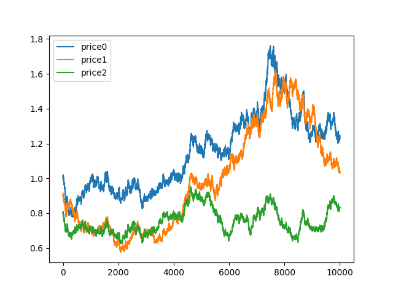

# Quick Start

Tools for analyzing risk in DeFi.

## Dependencies

* [python3](https://www.python.org/downloads) version 3.8 or greater, python3-dev

## Installation

### via `pip`

You can install the latest release via [`pip`](https://pypi.org/project/pip/):

```bash
pip install ape-risk
```

### via `setuptools`

You can clone the repository and use [`setuptools`](https://github.com/pypa/setuptools) for the most up-to-date version:

```bash
git clone https://github.com/ApeWorX/ape-risk.git
cd ape-risk
python3 setup.py install
```

## Quick Usage

Provides [hypothesis](https://github.com/HypothesisWorks/hypothesis) strategies to use in fuzz tests.

e.g. Mock prices generated by [Geometric Brownian motion](https://en.wikipedia.org/wiki/Geometric_Brownian_motion):

```python
import numpy as np
from ape_risk import strategies


@given(strategies.gbms(initial_value=1.0, num_points=100000, params=[0, 0.005]))
def test_gbms_param_fuzz(p):
    # strat gives a numpy.ndarray of simulated prices for each hypothesis run
    assert p.shape == (100000, 1)
    assert isinstance(p, np.ndarray)


C = np.asarray([[1, 0.5, 0.8], [0.5, 1, 0.4], [0.8, 0.4, 1]])
scale = np.linalg.cholesky(C).tolist()


@given(strategies.multi_gbms(initial_value=1.0, num_points=100000, num_rvs=3, params=[0, 0.005], scale=scale, shift=[0, 0, 0]))
def test_multi_gbms_param_fuzz(p):
    # strat gives a numpy.ndarray of multiple simulated prices for each hypothesis run
    assert p.shape == (100000, 1, 3)
    assert isinstance(p, np.ndarray)
```



## Development

This project is in development and should be considered an alpha.
Things might not be in their final state and breaking changes may occur.
Comments, questions, criticisms and pull requests are welcomed.
